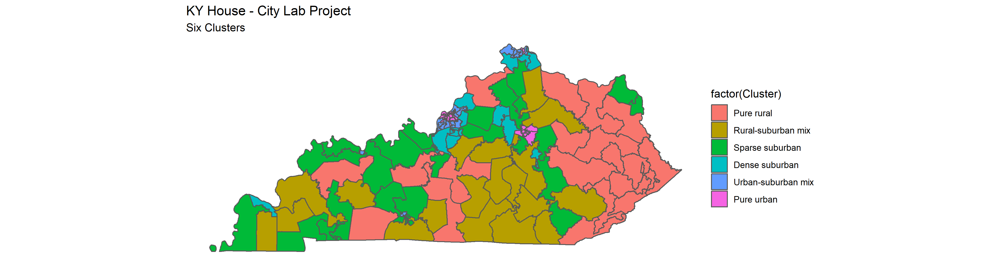

# Clustering KY House Districts

This project is based on [an idea implemented by **The Atlantic**'s _City Lab_](https://github.com/theatlantic/citylab-data/tree/master/citylab-congress), which sought to classify all 435 US House Districts into six clusters.  For this project, I have used the same algorithm to classify all Kentucky House Districts into three clusters.

Other thanks to Kentucky's Legislative Research Commission for [their maps](http://www.lrc.ky.gov/gis/maps.htm) of Kentucky's House Districts, and to [R-Studio](https://github.com/rstudio) for all their work creating packages that made almost all this work possible.

## Why Three Clusters Instead of Six
The original City Lab project included 6 clusters and named them based on descriptions they created. That number of clusters and the descriptions City Lab did for the US Congressional Districts didn't really work for KY. I've determined that the best number of clusters for KY is 3.  The clusters themselves also follow a bit different logic. City Lab was mostly concerned with the urban/suburban/rural divide. In KY the divided seemed to be more along the lines of urban/rural/suburban OR small city.

##### Six Clusters - Original City Lab Clustering

This is way too many clusters for KY House Districts, and you can see very quickly the logic breaks down from the names in the City Lab Project.  There doesn't seem to be much, if any, differentiation between "Rural-Suburban mix" and "Pure Rural", or between "Dense Suburban" and "Sparse Suburban".  I have no idea what is going on with "Urban-suburban mix" -- southwest Louisville qualifies as "urban-suburban", but east Louisville counts as "Dense Subrurban"?  Very quickly it's apparent that six is too many clusters.

#### Five Clusters

Dropping the number of clusters to five doesn't really solve our problem.  The differentiation between urban clusters (1 & 2) doesn't make much sense -- Lexington is almost all cluster 2, but suburban Louisville and most of Northern KY is cluster 1.  Meanwhile, some smaller cities are classified as cluster 4 (Ashland, Richmond, and Paducah), but others (Herderson, Hopkinsville, etc) are in cluster 5.  Then, it is unclear the differentiation between clusters 4 and 5 in rural areas.  While some places in cluster 4 include smaller cities, not all do.

#### Four Clusters

Moving on to four clusters still isn't perfect.   Owensboro now is tagged as "urban" along with most of Louisville and Lexington, but Bowling Green, the only other small district that only covers a city, is not.  Meanwhile, many of the groups in cluster 3 include small cities, but not all.  The inclusion of Woodford County in cluster 2...¯\\_(ツ)_/¯

#### Three Clusters

Although not perfect, three clusters seems right to me.  All but one district in Jefferson County is counted as "urban", and that one district is truly the most sparsely populated.  All of Lexington, most of Northern KY, Owenboro, and Bowling Green are county as urban.  The suburban/small city districts make sense.  They are either partially within an urban area, or mostly include a small city (Ashland, Paducah, Frankfort, Versailles, Richmond, Hopkinsville, etc).  The rest is covered as "rural", which makes sense to me, as Kentucky is mostly a rural state.

## Conclusion

Thanks to City Lab, the Kentucky LRC, and R Studio for all you do.  If you have any questions or comments, please get in touch.  And of course, listen to [My Old Kentucky Podcast](http://myoldkentuckypodcast.podbean.com/).
